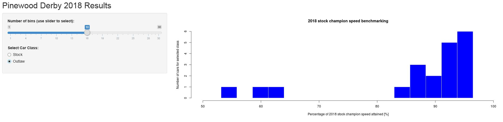

## PWD Racing: Introduction

- Pinewood Derby (PWD) racing is very competitive!
- The difference between a good run and a championship run is slim.
- Scaled speed in miles per hour is the common metric used.
- The scaled speed for the 2018 stock champion was 236.4 scaled MPH.

<br()>

The scaled speed is calculated as follows:
$$ \text{scaled speed} = \text{actual speed} * \frac{\text{full size car length}}{\text{PWD stock car length}}$$
- For a typical full size car length of approximately 180 inches, the scale factor ranges 25 and 27. 
- For the PWD Benchmark App: \[ \text{scale factor}=\frac{180}{7} \].

--- .class #id 

## Percentage of Stock Champion Speed Metric

- The Benchmark metric used by the app is the Percentage of the 2018 Stock Champion scaled speed:

$$ \text{Percentage Stock Champion Speed [%]} = 100*\frac{\text{your PWD car speed}}{\text{2018 Stock Champion Speed}} $$

- This metric provides a better sense about how cars in a particular event performed, compared to the 2018 champion's results.
- The difference between a car that wins a local race event and a national champion can be only a few percent!
- Don't be surprised if a majority of cars at a local event attain over 80% of the 2018 champion's speed.
- Outlaw class cars allow for some deviations for teh stock rules.For instance, more weight can be added. 
- You should expect outlaw cars to attain higher speeds than stock cars, although some failed design concepts can be very slow.

---

## Screenshot

- This is just a screen shot of the App: 

</img>

- It shows a Benchmark histogram for the selected car class.  
- You can select the number of bins on te histogram using a slider.
- You can also select to show results for the stock or outlaw cars in the sample data set.
- Sample data set was created for a local event (Pack 603, Sam Houston Council)

---

## Links

- If you want to test  the PWD Benchmarking App, I've provided a link to a demo of it here:
<https://dangitr.shinyapps.io/week4shinyappdjr/>
<br()>

- Axle friction reduction, axle alignment, and CG placement are typical factors that are adressed to improve performance. Learn more here:
<br()>

- [http://www.pinewoodderbyphysics.com/lectures.shtml](http://www.pinewoodderbyphysics.com/lectures.shtml) 
- [http://www.pinewoodphysics.com/](http://www.pinewoodphysics.com/) 
- [http://www-cs-students.stanford.edu/~mdevine/pinewood/pinewood_derby.html](http://www-cs-students.stanford.edu/~mdevine/pinewood/pinewood_derby.html) 

